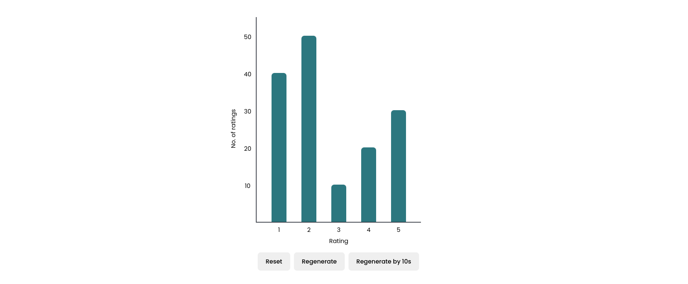

# Survey Sparrow Assessment

<p align="center">
 
</p>

This project demonstrates building a bar chart from scratch using React and plain CSS.

### Installation
Follow these steps to install and run the application:

1. Clone the Repository:

```bash
git clone https://github.com/SridharDnesh/Survey-Sparrow-Assessment.git
```
2. Install the dependencies:

```bash
npm install
```
3. Start the server:
```bash
npm run dev
```

### Tech stack
- React
- CSS Modules
- Vite


### Folder Structure

| Folder         | Description                                                          |
| -------------- | -------------------------------------------------------------------- |
| main.jsx       | Contains the react root element where our application will render on |
| index.html     | Main html file that is served when visiting the application          |
| public         | Contains the favicon of the application & can add any public assets  |
| src/components | Contains all the components used in the application                  |
| src/utils      | Contains all the helper functions and constants of the application   |
| vite.config.js | Contains config for vite build tool                                  |
| .eslintrc.cjs  | Contains default config provided by vite                             |

